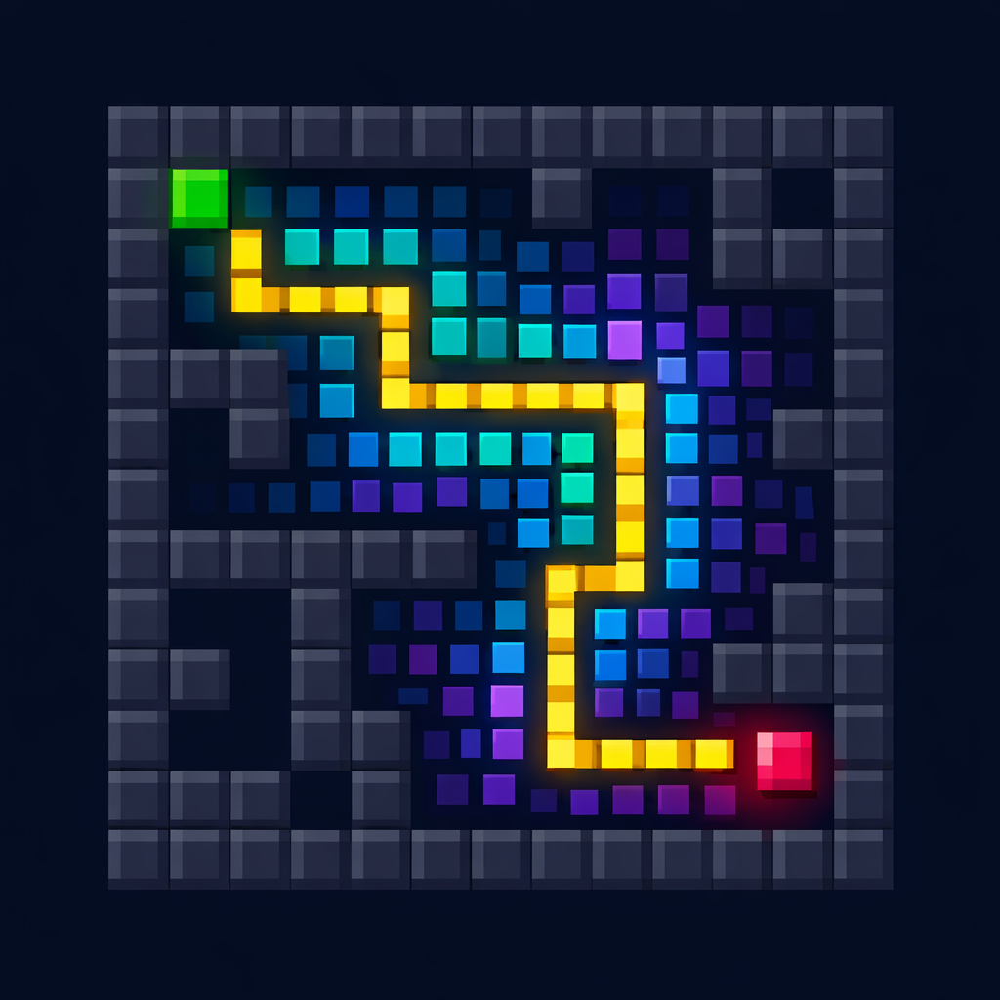

<!-- Project Banner -->

  

<!-- Project Icon -->

  

<h1 align="center">Pixel Path Solver</h1>

  Interactive pixel‑based pathfinding visualizer for road networks, GeoJSON data, and BFS traversal analysis.

  
  
  
  
  

# Pixel Path Solver

# Road Network Viewer + Pixel-Based Path Solver

This project provides a set of interactive HTML tools for loading road data,
visualizing rasterized road networks, selecting start/target nodes, and running
pixel-based pathfinding algorithms. The system supports magnetic snapping,
directional analysis, traversal visualization, and multi-step debugging.

---

## 📁 Project Structure

html/
├── index.html
├── drawRoads_magnatic_click.html
└── drawRoads_traversal_magnatic_click.html

data/
└── roads.geojson (or any user-provided file)
|__ Screenshots road images 

roads.pdf (new shortest path algorithims)

---

## 🚀 Features

### ✔ Pixel-based pathfinding  
- BFS (4-direction, 8-direction, 16-direction)  
- Magnetic snapping to nearest road pixel  
- Start/target selection by clicking  
- Direction totals (N/E/S/W)  
- Compass rose visualization  
- Turn counting, distance, complexity scoring  

### ✔ Road network visualization  
- Load GeoJSON road files  
- Draw roads as blue polylines  
- Highlight computed path in yellow  
- Show start (green) and target (red) markers  

### ✔ Traversal debugging  
- Step-by-step traversal animation  
- Pixel visitation order  
- Magnetic snapping visualization  

---
## 🚀 Novel Contributions

This project introduces a suite of four complementary algorithms that together form a unique framework for pixel‑based routing, traversal visualization, and road‑network analysis. Each algorithm contributes a distinct innovation, and the combined system offers capabilities rarely found in open‑source GIS or pathfinding tools.

---

### **1. Pixel‑Based Road Network Solver**
A novel raster‑first approach to road‑network routing:

- Converts GeoJSON roads into a **pixel grid**, preserving curvature and geometry.
- Treats each pixel as a navigable node, enabling **high‑resolution pathfinding**.
- Supports **16‑direction movement**, improving diagonal accuracy.
- Includes **magnetic snapping** to ensure start/target points always land on valid road pixels.
- Provides **BFS wavefront visualization** (teal → blue → indigo) for algorithm transparency.

This hybrid **GeoJSON → Pixel → BFS** pipeline is rarely used in GIS systems and enables intuitive debugging and educational visualization.

---

### **2. Longest‑White‑Path Solver**
A unique algorithm for exploring continuous white‑pixel regions:

- Identifies the **longest traversable corridor** in a binary image.
- Uses pixel connectivity to detect extended paths without predefined graph edges.
- Useful for:
  - Maze analysis  
  - Corridor detection  
  - Skeleton‑based path extraction  
- Operates without BFS or Dijkstra — purely pixel‑driven traversal.

This algorithm is novel because it treats the image as a **continuous geometric object**, not a graph, enabling organic path extraction.

---

### **3. 16‑Direction BFS Solver**
An enhanced BFS variant designed for rasterized road networks:

- Expands BFS to **16 movement directions**, capturing subtle diagonal transitions.
- Produces smoother, more realistic paths on pixel grids.
- Includes:
  - Direction totals  
  - Turn counting  
  - Path complexity scoring  
  - Compass rose visualization  
- Wavefront visualization reveals:
  - Reachable regions  
  - Dead ends  
  - Expansion patterns  

This is a rare extension of BFS that blends **grid traversal** with **directional analytics**.

---

### **4. Grid‑Based Neighbor / Image‑Traversal Solver**
A general‑purpose traversal engine for image‑based navigation:

- Operates directly on raster images (binary or grayscale).
- Uses neighbor‑based exploration to follow valid pixels.
- Supports:
  - Road tracing  
  - Maze following  
  - Boundary detection  
  - Region growing  
- Works without graph construction, relying purely on **pixel adjacency**.

This algorithm is novel because it provides a **lightweight, dependency‑free** alternative to classical graph‑based traversal, ideal for browser‑based visualization.

---

## 🎯 Combined System Novelty

Together, these four algorithms create a unique ecosystem:

- **Pixel‑accurate routing**  
- **Real‑time traversal visualization**  
- **GeoJSON integration without graph building**  
- **Directional and complexity‑based metrics**  
- **Fully client‑side, zero dependencies**  

This makes the project a rare blend of **GIS**, **image processing**, and **algorithm visualization**, all running directly in the browser.

---

# 📄 HTML Tools

Below are the three main HTML interfaces included in this repository.

---

## 1️⃣ `./html/index.html`  
### **Load road data + click to set start/target + compute path**

This is the **main interface** of the project.

#### **Features**
- Load a road network from `data/roads.geojson`
- Convert the road network into a pixel grid
- Click to set:
  - **Start point** (green)
  - **Target point** (red)
- Run pixel-based BFS to compute the shortest path
- Display:
  - Steps  
  - Distance (meters)  
  - Turns  
  - Time estimate  
  - Path complexity  
  - Direction totals  
  - Compass rose visualization  

#### **Usage**
1. Open `index.html` in a browser  
2. Click **Choose File** → select your GeoJSON  
3. Click on the map to set **start**  
4. Click again to set **target**  
5. The solver runs automatically  

---

## 2️⃣ `./html/drawRoads_magnatic_click.html`  
### **Load GeoJSON + magnetic snapping + click to add start/target**

This tool focuses on **road visualization + snapping**.

#### **Features**
- Load any GeoJSON road file  
- Draw all roads in blue  
- Magnetic snapping:
  - When clicking near a road, the click snaps to the nearest road pixel  
- Add start/target nodes  
- Visualize snapped points  

#### **Usage**
1. Open the file  
2. Load your GeoJSON  
3. Click anywhere near a road  
4. The system snaps your click to the nearest valid road pixel  

This is ideal for debugging snapping accuracy.

---

## 3️⃣ `./html/drawRoads_traversal_magnatic_click.html`  
### **Show traversal order + magnetic snapping + path animation**

This tool is for **debugging traversal and BFS behavior**.

#### **Features**
- Load GeoJSON  
- Magnetic snapping  
- Visualize BFS traversal:
  - Pixel visitation order  
  - Frontier expansion  
  - Animated path reconstruction  
- Show the final path in yellow  

#### **Usage**
1. Open the file  
2. Load your GeoJSON  
3. Click to set start and target  
4. Watch the traversal animation  

This is ideal for understanding how the BFS explores the grid.

---

# 🧠 Algorithms Included

The project implements:

- Pixel-based maze solver  
- Longest-white-path solver  
- 16-direction BFS solver  
- Grid-based neighbor solver  
- Image-based traversal solver  
- Left/right/up/down directional solver  

Each algorithm is documented in the LaTeX document included in this repo.

---

# 📦 Requirements

No external libraries required.  
Everything runs in the browser using:

- HTML5 Canvas  
- JavaScript  
- GeoJSON parsing  

---

# Screenshots

---

# ▶️ Running the Tools

Simply open the HTML files in any modern browser:

- Chrome  
- Firefox  
- Edge  

No server required.

---

# 📝 License

MIT License — free to use, modify, and distribute.

---

# 🙋‍♀️ Author

**Shaimaa Said Soltan**  
Pixel-based routing, GIS visualization, and algorithm design.

